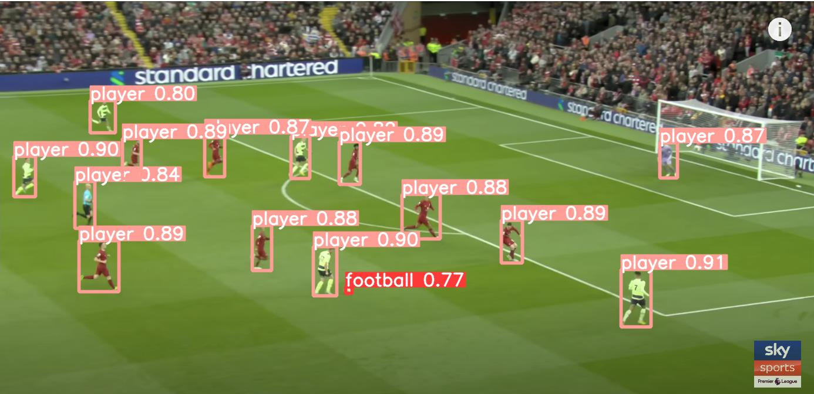
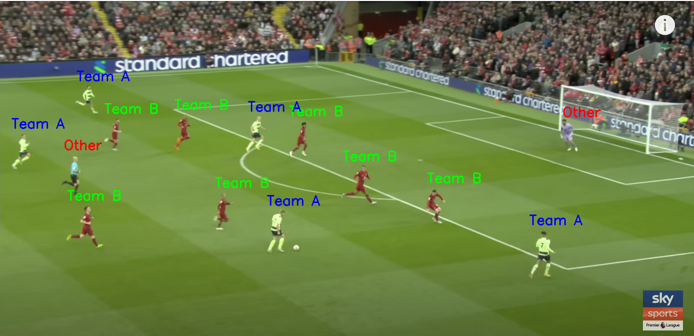
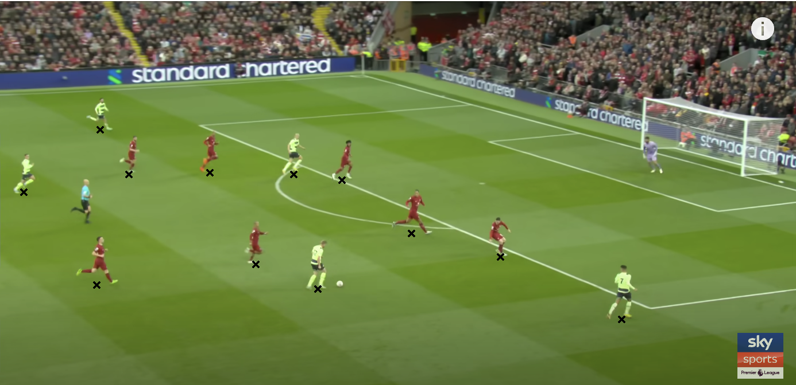
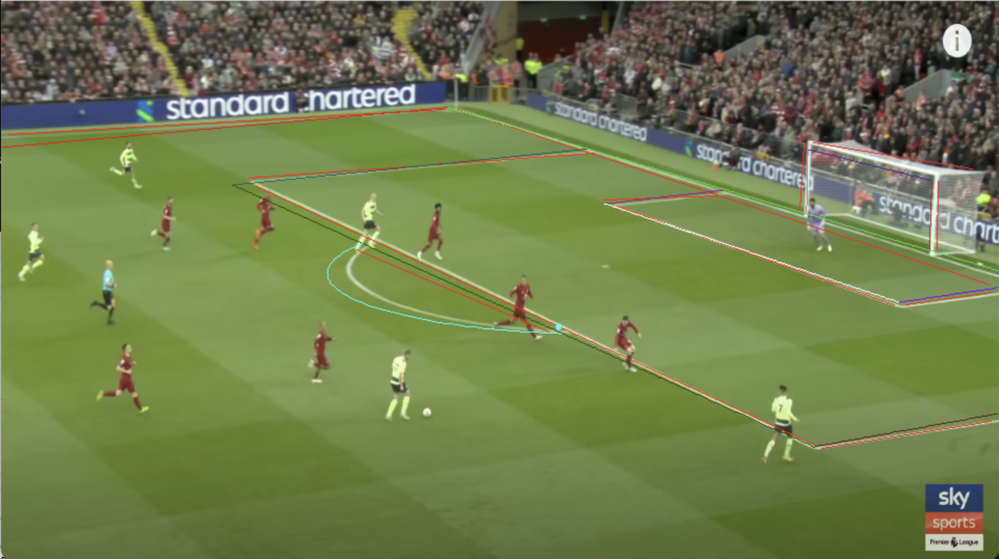
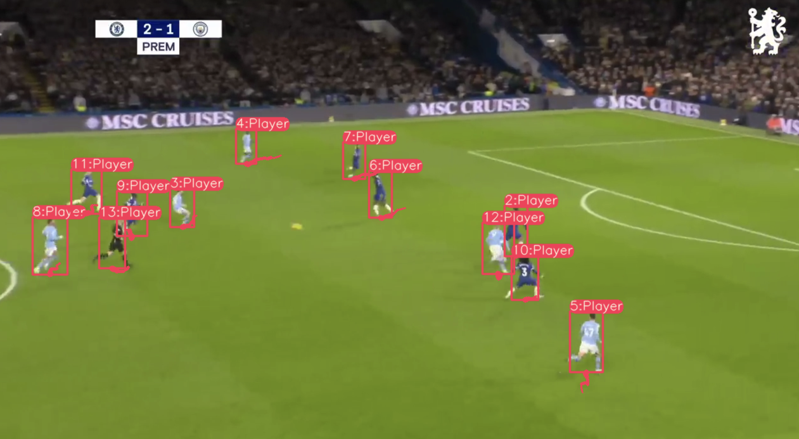
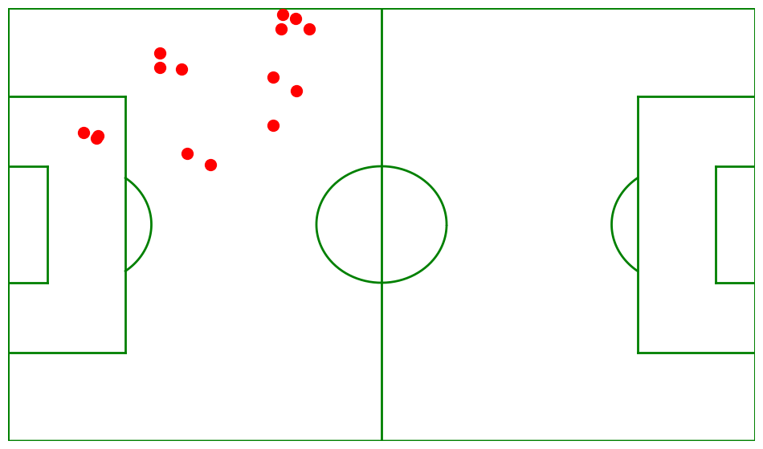

# Football Pitch Similarity
Extracting football game representations from broadcast images and querying a dataset to discover similar situations.

The Flask server exposes a POST endpoint at `/get-pitch-representation`. This endpoint expects an image of a broadcast view of a football pitch and returns a JSON object with normalised position of each player in each team and the ball.

## Methodology
The first step of our process involves object detection on the image, where bounding boxes are superimposed on each player and the ball. This detection procedure takes place in the [object detection] folder, utilizing a fine-tuned yolov5 multi-class classification model that specifically recognizes football players and balls.



We aim to focus solely on outfield players, but we acknowledge that the model may inadvertently pick up goalkeepers, referees, and other individuals near the pitch. To counter this, we employ the DBScan algorithm to discern two clusters from the upper half of each bounding box. Any identified individual who falls outside these two clusters is assigned the 'Other' label.



For each detected player, we consider the center of the bounding box's base as the player's location on the pitch.



Subsequently, the task is to compute the homography matrix. This matrix serves as a translator between a 2D top-down view of a football pitch and the actual football pitch identified in the image. To start, we detect the pitch itself. 

To perform this task, we apply a fine-tuned semantic segmentation deep learning model tailored for detecting football pitch lines. It utilizes a specialized version of the DeepLabV3 architecture with a ResNet-50 backbone. The end result of the model application is a segmented mask, highlighting the identified football pitch lines when overlaid on the original image.



Following pitch detection, we calculate a homography matrix that maps from the top-down pitch view to the one captured in the given image. This calculation allows us to pinpoint the player's position on a top-down pitch view. We then normalize the coordinates of each player and the ball to secure a consistent representation of the football pitch. This normalized representation is stored in the following format:

```json
{
    "ball_crds": [[0.594, 0.5005111389160156]], 
    "team1_crds": [[0.1082, 0.557], [0.174, 0.226]], 
    "team2_crds": [[0.871, 0.448], [0.365, 0.301]]
}
```

## Set-up
Follow these instructions to set up a Docker containers for recreating the project locally.
### Flask backend container

1. Navigate to the backend directory in your project repository.
    ```
    cd /backend
    ```

2. Create the Docker image using the Dockerfile present in the backend directory. We will name our image "football-flask-server".
    ```
    docker build -t football-flask-server .
    ```

3. Once the image is built, you can run a Docker container using the "football-flask-server" image. This will start your Flask server inside a Docker container.
    ```
    docker run -p 8080:5000 football-flask-server
    ```

The `-p` option binds the container's port 5000 (default Flask port) to the host's port 8080. You can change these as per your requirements.

## API structure

The Flask server exposes a POST endpoint at `/get-pitch-representation`. This endpoint expects an image of a broadcast view of a football pitch and returns a JSON object with normalised position of each player in each team and the ball.

### Request
- Method: `POST`
- Endpoint: `/get-pitch-representation`
- Body: An image file of a broadcast view of a football pitch

### Response

The response is a JSON object with the positions of players and the ball. All coordinates are normalised between 0 and 1. The JSON response has the following format:

```json
{
    "ball_crds": [[0.594, 0.5005111389160156]], 
    "team1_crds": [[0.1082, 0.557], [0.174, 0.226]], 
    "team2_crds": [[0.871, 0.448], [0.365, 0.301]]
}
```

### Further work: Object Tracking

Further work has focused on tracking players through multiple frames. The DeepSORT algorithm works well in using multi-frame information to identify players even when occluded, which is commonly the case. Each player is assigned a `player_id`. This allows us to perform our team assignment using multiframe information. In the image below we see each player with their `player_id` and a path drawn to show the player's movement from previous frames.



Using the homography transformation in tandem with the video data, we are able to create a video of where the players are on the pitch through time via a bird's eye view. Note that the below clip does not correspond to the above video, and refinement on the homography approach needs to be performed for an entirely accurate pitch representation.

[](./images/video.mp4)


## References
- The homography Neural Network has been trained  and provided by [SoccerNet](https://www.soccer-net.org/).